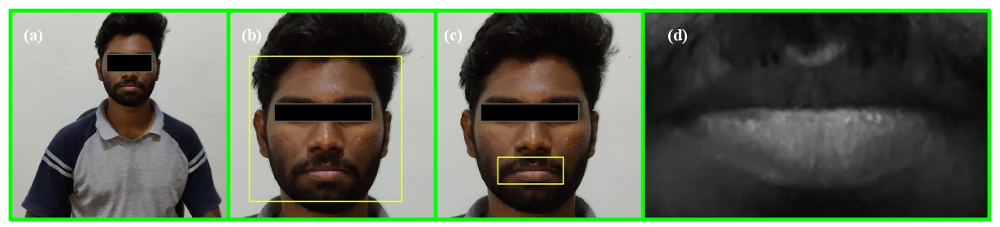
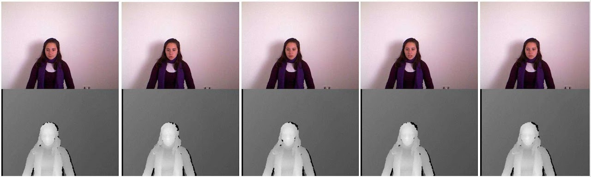

# LIPAR
This is the official implementation of our paper titled: **LIPAR -  Dynamic Person Independent Holistic Visual Speech Recognizer** submitted to review at IEEE Transactions on Artificial Intelligence

## Overview
- Preprocessed and Extracted the Lip RoI from the MIRACL-VC1 dataset using the state-of-the-art preprocessing techniques. 

- A novel 3D Deep learning framework is proposed for estimating the word spoken from the user’s videotape.
- Developed an autonomous smart application prototype for edge devices without any manual intervention
- A real-time dataset similar to the existing MIRACL-VC1 dataset consisting of 35 speakers to perform the task of word-level VSR is prepared.

## Dataset
MIRACL-VC1 is a lip-reading dataset including both depth and color images. It can be used for diverse research fields like visual speach recognition, face detection, and biometrics. Fifteen speakers (five men and ten women) positioned in the frustum of a MS Kinect sensor and utter ten times a set of ten words and ten phrases. Each instance of the dataset consists of a synchronized sequence of color and depth images (both of 640x480 pixels).  The MIRACL-VC1 dataset contains a total number of 3000 instances.

Please download the MIRACL-VC1 dataset from [here](https://sites.google.com/site/achrafbenhamadou/-datasets/miracl-vc1)

## Additional Files
Please download the Dlib Facial Landmarks Detector from [here](https://github.com/tzutalin/dlib-android/blob/master/data/shape_predictor_68_face_landmarks.dat) and place it in the models folder

## Features
- [x] State-of-the-art preprocessing, RoI extraction and feature normalization techniques
- [x] A novel 3D Deep learning framework is proposed for estimating the word spoken from the user’s videotape
- [ ] Publically available LIPAR dataset
- [ ] Application Prototype to full deployment
